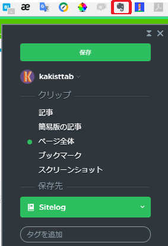
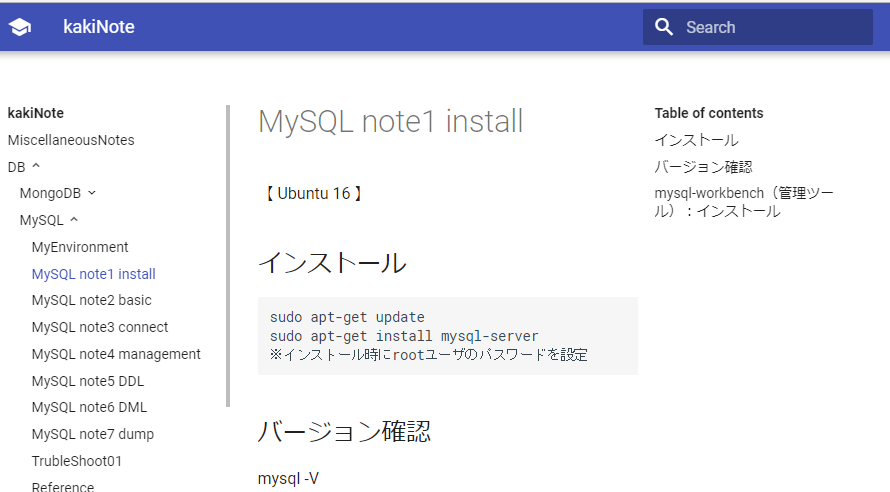

### 俺式情報整理術
　
　  
　  
　　　　id:kakisoft
---
### 自己紹介  
　  
**名前**：垣花　暁（かきのはな　さとる）    
　  
**出身**：沖縄県  
　  
**仕事**：物流系エンジニア（フリーランス）  
.NET/Java/Oracleがメイン。  
物流業界向けの言語や機器が使えます。  
　  
**趣味**：リアル脱出ゲーム
---
凄まじいスピードで進化していくIT業界。  
日々、様々な情報が流れて行きます。
---
必要となる情報源にアンテナを張り、  
チェックしていく事も重要ですが、  
それを自分の情報として留めておくことも  
重要ではないかと思います。
---
自分には、こういった事は良くあります。
---
あれ？  
そういえば、以前調べたアレ、  
どんな内容だっけ？
---
そういえば、あのコード、  
どうやって書くんだっけ？
---
・・・という事を、少しでも減らすために、  
自分が工夫している事をつらつら話すスライドです。
---
#### 自分における情報整理の目的
　　　
必要な情報を、  
必要な時に、  
手軽に素早く取り出せる事
　　　
・・・が目標。
---
### １．ブログに書く
---
グローバルメモ帳として、非常に有用。  
書けば、いつでもどこでも取り出せる。  
　　　
調べた事を自分の中に整理させておくには有用。  
あやふやだった部分も、改めて調べ直すきっかけにもなる。
---
#### ためらいがちになる点
 * 確信を持てない情報は書きづらい
 * もっと質の高い記事を見つけてしまった場合、書く気が失せる。
---
### ２．コードを GitHubにブチ込む
---
最初、gistに保存していたが、ファイル数が増えていくと
必要な情報を取り出しづらくなったので、リポジトリにぶち込む事にしました。  
　　　
また、カテゴリごとに分けたかった。  
---
サンプルソースや書きかけのコードも、  
気にせず放り込んでます。  
（未完成だろうと、後で読み返したくなるケースがあるので。）
---
誰でも見れる状態になりますが、  
そこは気にしない事にしています。
---
勉強会でメモっておきたい事の走り書きも、  
未完成のままブチ込んでます。  
---
「整理して後でまとめよう。」という行動を諦め、  
雑多なままの状態でも保存しといて、  
検索は GitHubの検索機能に頼ろう。  
という考えです。
---
### ３．非公開の情報に Bitbuket を使用
---
無料でプライベートリポジトリ枠があります。

外に公開しない情報、日記やポエム。  
ブログの草案なんかをブチ込んでいます。
---
「Google Drive とか Drop Boxでもいいんじゃね？」  
という意見もあるかと思いますが、  
履歴管理ができるのは便利です。
---
<h3 style="text-transform:none;">４．整理しきれない情報は、Evernote を活用</h3>
---
調べものをしているうちに、  
ブラウザのタブがこうなる事って、ありますよね。

んで、いつの間にか、そろそろ寝る時間に・・・
---
とりあえず、お気に入りに保存して寝るかー！
　  
→ そしてカオス化するお気に入りリスト・・・
---
そんな時、Evernoteが便利です。

整理しきれないWebページを、どんどん放り込みます。
---
放り込んだ後は、  
適当なキーワードで検索可能です。

---
Evernoteは、  
　  
「情報を整理しないままブチ込み、  
　雑多な状態のまま取り出す」  
　  
には、非常に便利なツールです。
---
<h3 style="text-transform:none;">５．ある程度整理した情報は、MkDocs を利用</h3>
---
## MkDocs
静的ページジェネレータ。
jekyll や Sphinx みたいなもの。
---
使い方がシンプル。
ひな形を作った後、
Docsフォルダに mdファイルを放り込む。
GitHubにデプロイするコマンドがある。
---
こんな感じ。（GitHub Pagesを使用）

---
検索機能があります。

---
「きっちりと整頓はしてないけど、
　後で読み返したい雑文」
　  
の保存方法として活用しています。
---
皆様は、どんな風に情報を整理し、活用していますか？
---
「こんな方法があるよ！」といいたノウハウがあれば、是非教えて下さい。
---
終わり

